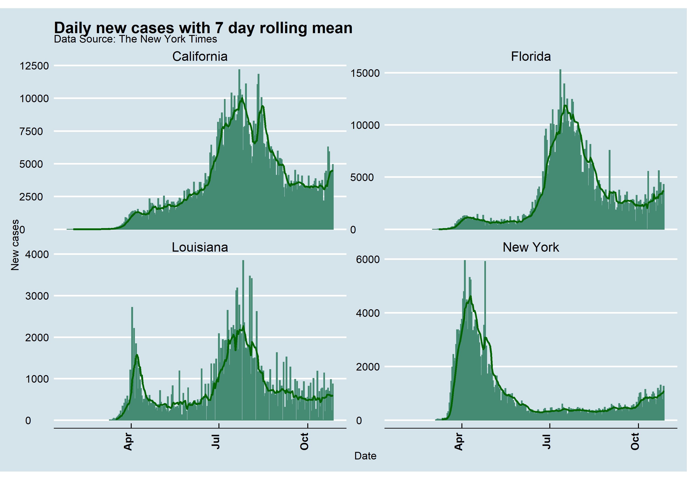
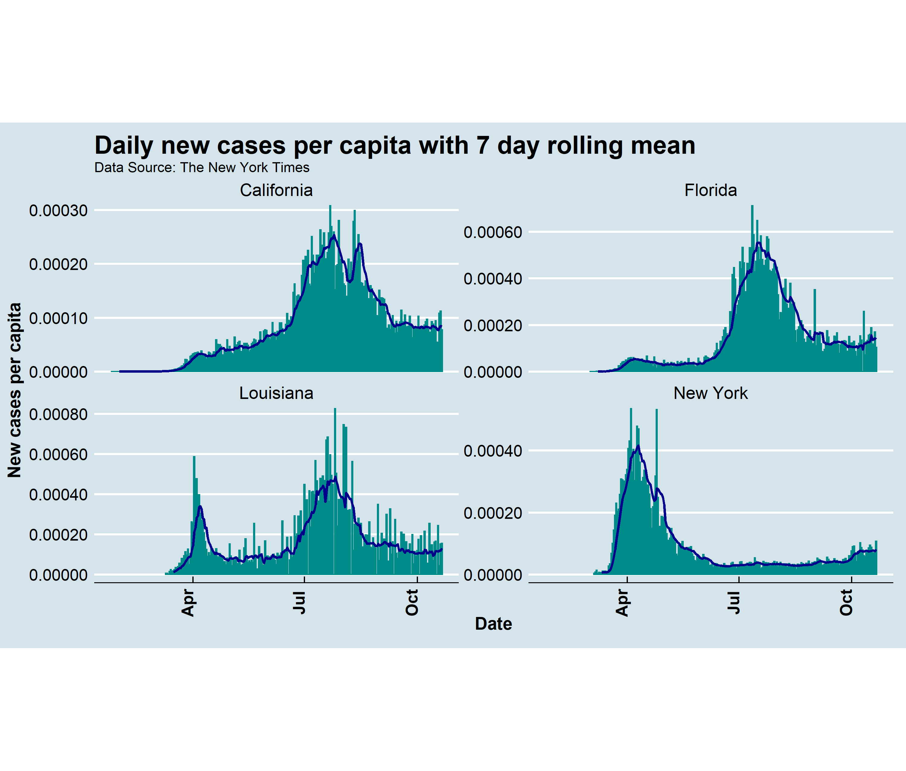

# Question 1:
The 5 counties with most cumulative cases are shown in the table below.
```{r, warning = FALSE}
library(tidyverse)
library(knitr)
library(readxl)
library(zoo)
library(ggthemes)
library(scales)

pop = read_excel('../data/PopulationEstimates.xls', skip = 2) %>%
  select(pop2019 = POP_ESTIMATE_2019, fips = FIPStxt)


covid_url = 'https://raw.githubusercontent.com/nytimes/covid-19-data/master/us-counties.csv'

covid = read_csv(covid_url)

state_1 = 'California'
```
# Question 1:
```{r, warning = FALSE }
newData = inner_join(pop, covid, by = 'fips') %>%
  filter(state == state_1) %>%
  group_by(county) %>%
  mutate(new_cases = cases - lag(cases))
```

The 5 counties with the most cases is shown below.
```{r, warning = FALSE}
mostCases = newData %>%
  group_by(county) %>%
  summarise(cases = sum(cases, na.rm = TRUE)) %>%
  ungroup() %>%
  arrange(-cases) %>%
  slice_max(cases, n = 5)

knitr::kable(mostCases, caption = paste(state_1, 'counties with the most cumulative cases'), col.names = c('County', 'Cases'))

```
The counties with the most new cases is shown below.
```{r,  warning = FALSE}
mostNewCases = newData %>%
  select(county, new_cases) %>%
  group_by(county) %>%
  summarise(new_cases = sum(new_cases, na.rm = TRUE)) %>%
  arrange(-new_cases) %>%
  slice_max(new_cases, n = 5)

knitr::kable(mostNewCases, caption = paste(state_1, 'counties with the most new cases'),
             col.names = c('County', 'New Cases'))
```


The state of California has determined that counties in which there have been more than 100 new cases per 100,000 residents over the past 14 days are to placed on a watch list that monitors for worsening coronavirus trends. There are 13 counties determined to be safe by this criteria. The 14 safe counties are:
```{r, message = TRUE, warning = FALSE} 
last14days = newData %>%
  filter(date > max(date) - 13) %>%
  group_by(county, pop2019) %>%
  summarise(new_cases = sum(new_cases)) %>%
  ungroup() %>%
  mutate(casePer100 = new_cases / (pop2019 / 100000)) %>%
  filter(casePer100 <= 100) %>%
  pull(county) 

last14days

knitr::kable(last14days, caption = paste(state_1, 'counties with the most new cases'),
             col.names = c('County'))
``` 

# Question 2:





In the second plot we scaled for population and you can that although California has a large number of new cases, the number of new cases per capita is lower compared to Florida and Louisiana which are experiencing a large number of new cases with respect to population.  


