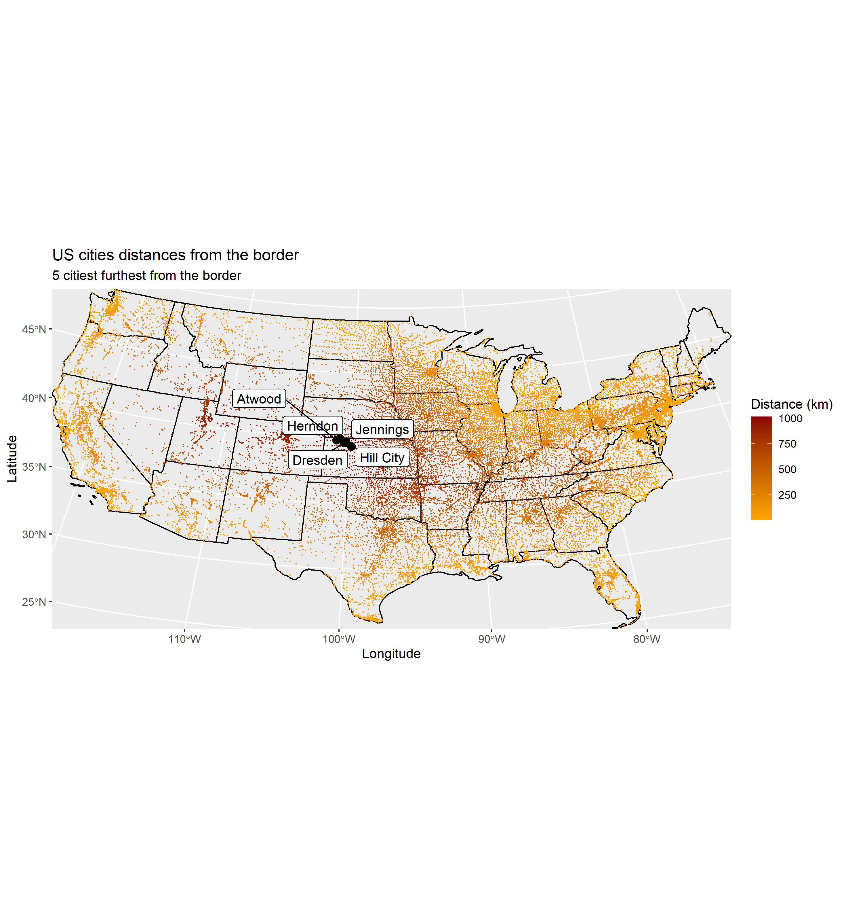

# Lab 03: Distances and the Border Zone
```{r, message = FALSE, warning = FALSE}


# Lab 03: Distances and the Border Zone
## Author: Angus Watters
# Question 1:
```{r, message = FALSE, warning = FALSE, echo = FALSE}
library(tidyverse)
library(sf)
library(units)
library(USAboundaries)
library(rnaturalearth)
library(gghighlight)
library(ggrepel)
library(knitr)
```

#Question 1:

```{r, message = FALSE, warning = FALSE, echo = FALSE}
# 1.1 Define a Projection

eqdc = '+proj=eqdc +lat_0=40 +lon_0=-96 +lat_1=20 +lat_2=60 +x_0=0 +y_0=0 +datum=NAD83 +units=m +no_defs'


# 1.2 - Get USA state boundaries
conus = us_states() %>%
  st_as_sf(coords = c('lng', 'lat'), crs = 4326) %>%
  filter(!name %in% c('Puerto Rico', 'Alaska', 'Hawaii'))


# 1.3 - Get country boundaries for Mexico, the United States of America, and Canada
country = countries110 %>%
  st_as_sf(coords = c('lng', 'lat'), crs = 4326) %>%
  filter(admin %in% c('Mexico', 'United States of America', 'Canada'))


# 1.4 - Get city locations from the CSV file
cities = read_csv('../data/uscities.csv') %>%
  st_as_sf(coords = c('lng', 'lat'), crs = 4326) %>%
  filter(!state_name %in% c('Puerto Rico', 'Alaska', 'Hawaii'))


# transform cities, conus, country projections to eqdc
cities = st_transform(cities, eqdc)
conus = st_transform(conus, eqdc)
country = st_transform(country, eqdc)
```


# Question 2:

```{r, message = FALSE, warning = FALSE, echo = FALSE}
# 2.1 - Distance to USA Border (km)

#exterior US border
conus_u = st_union(conus) %>%
  st_cast('MULTILINESTRING')

# distance from US cities to US border
cities_b = cities %>%
  mutate(dist_border = st_distance(cities, conus_u), dist_border = set_units(dist_border, 'km'), dist_border = drop_units(dist_border)) %>%
  select(city, state_name, dist_border) %>%
  arrange(-dist_border)

# 5 citiest furthest from US border, geometry dropped
cities_b_five_nogeom = cities_b %>%
  st_drop_geometry() %>% 
  head(5)


knitr::kable(cities_b_five_nogeom, caption = '5 citiest farthest from US border', col.names = c('City', 'State', 'Distance to border'))


# 5 citiest furthest from US border
cities_b_five = cities_b %>%
  head(5)


# 2.2 - Distance to States (km)
conus_c = st_combine(conus) %>%
  st_cast('MULTILINESTRING')


# distance from US cities to  US state
cities_s = cities %>%
  mutate(dist_state = st_distance(cities, conus_c), dist_state = set_units(dist_state, 'km'), dist_state = drop_units(dist_state)) %>%
  select(city, state_name, dist_state) %>%
  arrange(-dist_state)


# 5 citiest furthest from state border, geometry dropped
cities_s_five_nogeom = cities_s %>%
  st_drop_geometry() %>%
  head(5)

knitr::kable(cities_s_five_nogeom, caption = '5 citiest farthest from US border', col.names = c('City', 'State', 'Distance to state border'))


# 5 citiest furthest from US state border
cities_s_five = cities_s %>%
  head(5)


# 2.3 - Distance to Mexico (km)

# mexico border
mexico = country %>%
  filter(admin %in% 'Mexico') %>%
  st_union() %>%
  st_cast('MULTILINESTRING')


# distance US cities to Mexico border, geometry dropped
mex_cities_nogeom = cities %>%
  mutate(dist_mex = st_distance(cities, mexico), dist_mex = set_units(dist_mex, 'km'), dist_mex = drop_units(dist_mex)) %>%
  select(city, state_name, dist_mex) %>%
  arrange(-dist_mex) %>%
  st_drop_geometry() %>% 
  head(5)

knitr::kable(mex_cities_nogeom, caption = '5 citiest farthest from Mexico border', col.names = c('City', 'State', 'Distance to Mexico border'))


# distance from US cities to Mexico border
mex_cities = cities %>%
  mutate(dist_mex = st_distance(cities, mexico), dist_mex = set_units(dist_mex, 'km'), dist_mex = drop_units(dist_mex)) %>%
  select(city, state_name, dist_mex) %>%
  arrange(-dist_mex) %>%
  head(5)


# 2.4 - Distance to Canada (km)

# canada border
canada = country %>%
  filter(admin %in% 'Canada') %>%
  st_union() %>%
  st_cast('MULTILINESTRING')

# distance US cities to Canadian border, geometry dropped
canada_cities_nogeom = cities %>%
  mutate(dist_can = st_distance(cities, canada), dist_can = set_units(dist_can, 'km'), dist_can = drop_units(dist_can)) %>%
  select(city, state_name, dist_can) %>%
  arrange(-dist_can) %>%
  st_drop_geometry() %>% 
  head(5)

knitr::kable(canada_cities_nogeom, caption = '5 citiest farthest from Canadian border', col.names = c('City', 'State', 'Distance to Canada border'))


# distance from US cities to Canada border
canada_cities = cities %>%
  mutate(dist_can = st_distance(cities, canada), dist_can = set_units(dist_can, 'km'), dist_can = drop_units(dist_can)) %>%
  select(city, state_name, dist_can) %>%
  arrange(-dist_can) %>%
  head(5)
```

# Question 3:

# 3.1 Most populated US cities
```{r, message = FALSE, warning = FALSE, echo = FALSE}
# 3.1 Data

# 10 most populated US cities
big_cities = cities %>%
  select(city, state_name, population) %>%
  arrange(-population) %>%
  head(10)

# ggplot of ten most populated cities in US
most_pop_cities_ggplot = ggplot() +
  geom_sf(data = conus, fill = 'cornflowerblue', alpha = .5, size = .5) +
  geom_sf(data = mexico, lty = 1) +
  geom_sf(data = canada, lty = 1) +
  geom_sf(data = big_cities, aes(city, state_name), col = 'black', size = 3) +
  geom_label_repel(data = big_cities, aes(geometry = geometry, label = city), stat = 'sf_coordinates') +
  labs(title = 'Ten most populated US cities',
       x = 'Longitude',
       y = 'Latitude')
```





