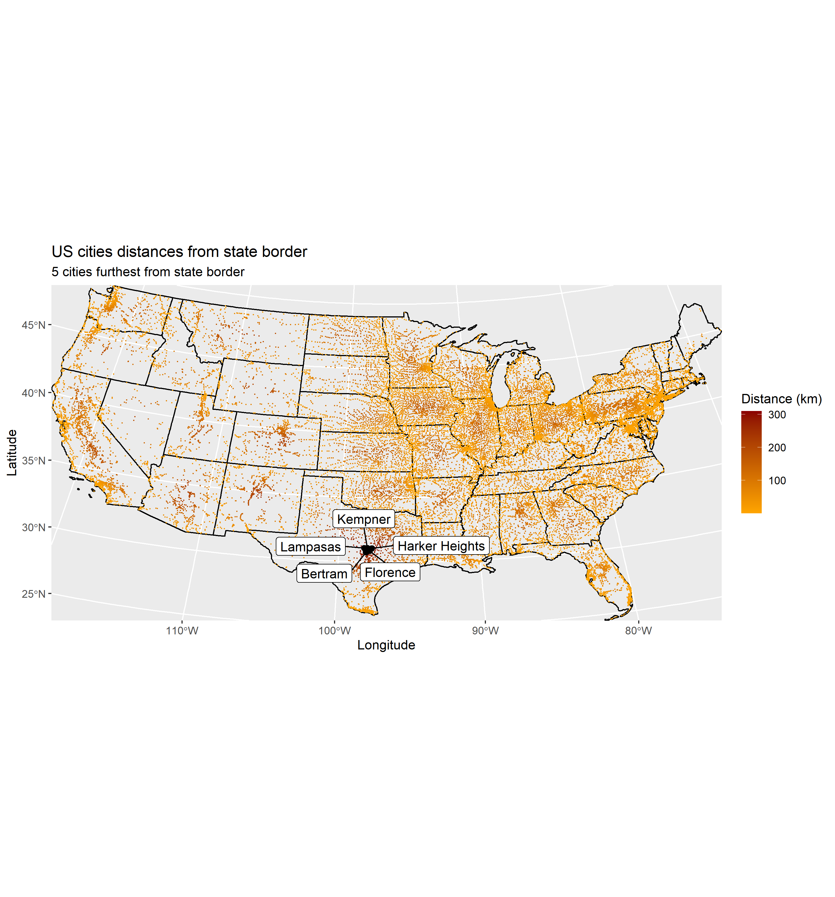
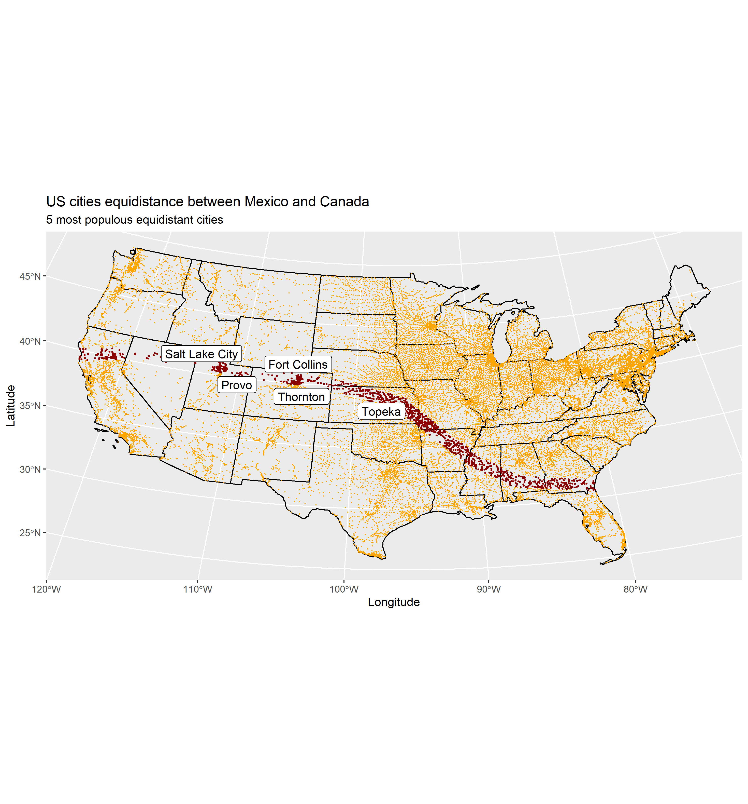
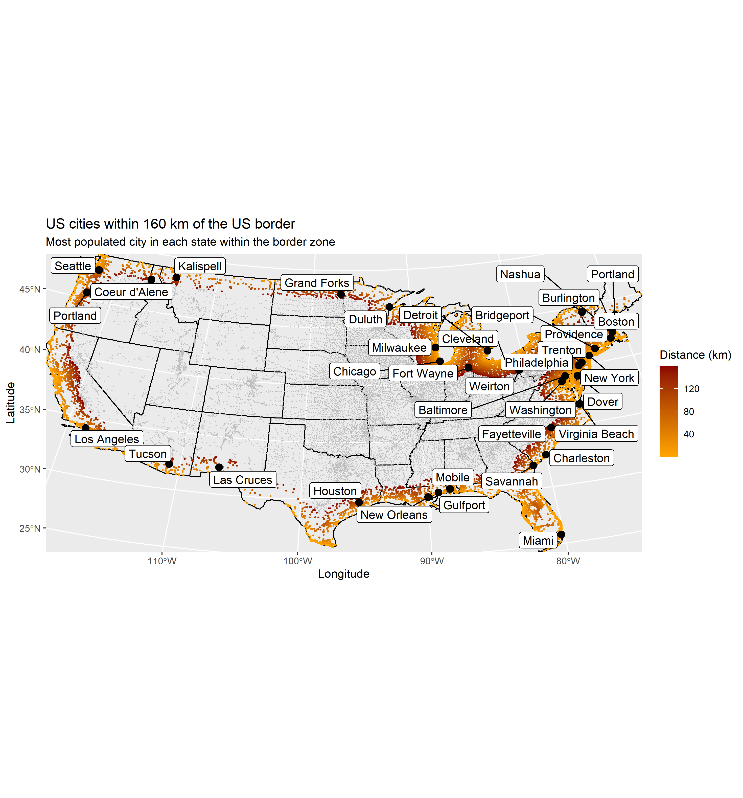

# Lab 03: Distances and the Border Zone
```{r, message = FALSE, warning = FALSE}
# Angus Watters
# Due date: 08/24/2020
# Geog - 176A
# Lab 03

library(tidyverse)
library(sf)
library(units)
library(USAboundaries)
library(rnaturalearth)
library(gghighlight)
library(ggrepel)
library(knitr)
```

# Question 1:

## 1.1 Define a Projection

```{r, message = FALSE, warning = FALSE}
eqdc = '+proj=eqdc +lat_0=40 +lon_0=-96 +lat_1=20 +lat_2=60 +x_0=0 +y_0=0 +datum=NAD83 +units=m +no_defs'
```

## 1.2 - Get USA state boundaries
```{r, message = FALSE, warning = FALSE}
conus = us_states() %>%
  st_as_sf(coords = c('lng', 'lat'), crs = 4326) %>%
  filter(!name %in% c('Puerto Rico', 'Alaska', 'Hawaii'))
```

## 1.3 - Get country boundaries for Mexico, the United States of America, and Canada
```{r, message = FALSE, warning = FALSE}
country = countries110 %>%
  st_as_sf(coords = c('lng', 'lat'), crs = 4326) %>%
  filter(admin %in% c('Mexico', 'United States of America', 'Canada'))
```

## 1.4 - Get city locations from the CSV file
```{r, message = FALSE, warning = FALSE}
cities = read_csv('../data/uscities.csv') %>%
  st_as_sf(coords = c('lng', 'lat'), crs = 4326) %>%
  filter(!state_name %in% c('Puerto Rico', 'Alaska', 'Hawaii'))

# transform cities, conus, country projections to eqdc
cities = st_transform(cities, eqdc)
conus = st_transform(conus, eqdc)
country = st_transform(country, eqdc)
```

# Question 2:

## 2.1 - Distance to USA Border (km)
```{r, message = FALSE, warning = FALSE}
#exterior US border
conus_u = st_union(conus) %>%
  st_cast('MULTILINESTRING')

# distance from US cities to US border
cities_b = cities %>%
  mutate(dist_border = st_distance(cities, conus_u), dist_border = set_units(dist_border, 'km'), dist_border = drop_units(dist_border)) %>%
  select(city, state_name, dist_border) %>%
  arrange(-dist_border)

# 5 citiest furthest from US border, geometry dropped
cities_b_five_nogeom = cities_b %>%
  st_drop_geometry() %>% 
  head(5)
# 5 citiest furthest from US border
cities_b_five = cities_b %>%
  head(5)

knitr::kable(cities_b_five_nogeom, caption = '5 citiest farthest from US border', col.names = c('City', 'State', 'Distance to border'))
```

## 2.2 - Distance to States (km)
```{r, message = FALSE, warning = FALSE}
conus_c = st_combine(conus) %>%
  st_cast('MULTILINESTRING')


# distance from US cities to  US state
cities_s = cities %>%
  mutate(dist_state = st_distance(cities, conus_c), dist_state = set_units(dist_state, 'km'), dist_state = drop_units(dist_state)) %>%
  select(city, state_name, dist_state) %>%
  arrange(-dist_state)

# 5 citiest furthest from state border, geometry dropped
cities_s_five_nogeom = cities_s %>%
  st_drop_geometry() %>%
  head(5)

# 5 citiest furthest from US state border
cities_s_five = cities_s %>%
  head(5)

knitr::kable(cities_s_five_nogeom, caption = '5 citiest farthest from US border', col.names = c('City', 'State', 'Distance to state border'))
```

## 2.3 - Distance to Mexico (km)
```{r, message = FALSE, warning = FALSE}
# mexico border
mexico = country %>%
  filter(admin %in% 'Mexico') %>%
  st_union() %>%
  st_cast('MULTILINESTRING')

# distance US cities to Mexico border, geometry dropped
mex_cities_nogeom = cities %>%
  mutate(dist_mex = st_distance(cities, mexico), dist_mex = set_units(dist_mex, 'km'), dist_mex = drop_units(dist_mex)) %>%
  select(city, state_name, dist_mex) %>%
  arrange(-dist_mex) %>%
  st_drop_geometry() %>% 
  head(5)

# distance from US cities to Mexico border
mex_cities = cities %>%
  mutate(dist_mex = st_distance(cities, mexico), dist_mex = set_units(dist_mex, 'km'), dist_mex = drop_units(dist_mex)) %>%
  select(city, state_name, dist_mex) %>%
  arrange(-dist_mex) %>%
  head(5)

knitr::kable(mex_cities_nogeom, caption = '5 citiest farthest from Mexico border', col.names = c('City', 'State', 'Distance to Mexico border'))
```


## 2.4 - Distance to Canada (km)
```{r, message = FALSE, warning = FALSE}
# canada border
canada = country %>%
  filter(admin %in% 'Canada') %>%
  st_union() %>%
  st_cast('MULTILINESTRING')

# distance US cities to Canadian border, geometry dropped
canada_cities_nogeom = cities %>%
  mutate(dist_can = st_distance(cities, canada), dist_can = set_units(dist_can, 'km'), dist_can = drop_units(dist_can)) %>%
  select(city, state_name, dist_can) %>%
  arrange(-dist_can) %>%
  st_drop_geometry() %>% 
  head(5)

# distance from US cities to Canada border
canada_cities = cities %>%
  mutate(dist_can = st_distance(cities, canada), dist_can = set_units(dist_can, 'km'), dist_can = drop_units(dist_can)) %>%
  select(city, state_name, dist_can) %>%
  arrange(-dist_can) %>%
  head(5)

knitr::kable(canada_cities_nogeom, caption = '5 citiest farthest from Canadian border', col.names = c('City', 'State', 'Distance to Canada border'))
```

# Question 3:

## 3.1 Data
```{r, message = FALSE, warning = FALSE}
# 10 most populated US cities
big_cities = cities %>%
  select(city, state_name, population) %>%
  arrange(-population) %>%
  head(10)

# ggplot of ten most populated cities in US
most_pop_cities_ggplot = ggplot() +
  geom_sf(data = conus, fill = 'cornflowerblue', alpha = .5, size = .5) +
  geom_sf(data = mexico, lty = 1) +
  geom_sf(data = canada, lty = 1) +
  geom_sf(data = big_cities, aes(city, state_name), col = 'black', size = 3) +
  geom_label_repel(data = big_cities, aes(geometry = geometry, label = city), stat = 'sf_coordinates') +
  labs(title = 'Ten most populated US cities',
       x = 'Longitude',
       y = 'Latitude')
```


## 3.2 City Distance from the Border
``````{r, message = FALSE, warning = FALSE}
# ggplot of cities distance from border
distance_to_border_ggplot = ggplot() +
  geom_sf(data = conus_c) +
  geom_sf(data = cities_b, aes(col = dist_border), size = .1) +
  scale_color_gradient(low = 'orange', high = 'darkred') +
  geom_sf(data = cities_b_five, aes(city, state_name), col = 'black', size = 3) +
  geom_label_repel(data = cities_b_five, aes(geometry = geometry, label = city), stat = 'sf_coordinates') +
  labs(title = 'US cities distances from the border',
       x = 'Longitude',
       y = 'Latitude',
       color = 'Distance (km)',
       subtitle = '5 citiest furthest from the border') +
  theme(aspect.ratio = .5)
```


## 3.3 City Distance from Nearest State
```{r, message = FALSE, warning = FALSE}
# ggplot of cities distance from state border
distance_to_states_ggplot = ggplot() +
  geom_sf(data = conus_c) +
  geom_sf(data = cities_s, aes(col = dist_state), size = .1) +
  scale_color_gradient(low = 'orange', high = 'darkred') +
  geom_sf(data = cities_s_five, aes(city, state_name), col = 'black', size = 2) +
  geom_label_repel(data = cities_s_five, aes(geometry = geometry, label = city), stat = 'sf_coordinates') +
  labs(title = 'US cities distances from state border',
       x = 'Longitude',
       y = 'Latitude',
       color = 'Distance (km)',
       subtitle = '5 cities furthest from state border') +
  theme(aspect.ratio = .5)
```


## 3.4 Equidistance boundary from Mexico and Canada
```{r, message = FALSE, warning = FALSE}
eqd_cities = cities %>%
  mutate(dist_can = st_distance(cities, canada), dist_can = set_units(dist_can, 'km'), dist_can = drop_units(dist_can)) %>%
  mutate(dist_mex = st_distance(cities, mexico), dist_mex = set_units(dist_mex, 'km'), dist_mex = drop_units(dist_mex)) %>%
  mutate(mex_can = abs(dist_mex - dist_can)) %>%
  select(city, state_name, mex_can, population) %>%
  filter(mex_can <= 100)

eqd_cities_pop = eqd_cities %>%
  select(city, state_name, population) %>%
  arrange(-population) %>%
  head(5)

# ggplot of cities equidistance from Mexico-Canada
equidist_ggplot = ggplot() +
  geom_sf(data = conus_c, size = .5) +
  geom_sf(data = cities, col = 'orange', size = .1) +
  geom_sf(data = eqd_cities, col = 'darkred', size = .5) +
  gghighlight(mex_can <= 100) +
  geom_label_repel(data = eqd_cities_pop, aes(geometry = geometry, label = city), col = 'black', stat = 'sf_coordinates') +
  labs(title = 'US cities equidistance between Mexico and Canada',
       x = 'Longitude',
       y = 'Latitude',
       subtitle = '5 most populous equidistant cities') +
  theme(aspect.ratio = .5)
```


# Question 4:

## 4.1 Quantifing Border Zone
```{r, message = FALSE, warning = FALSE}
#cities within 160 km of border
border_zone = cities %>%
  st_as_sf(coords = c('lng', 'lat'), crs = 4326) %>%
  mutate(dist_to_border = st_distance(cities, conus_u), dist_to_border = set_units(dist_to_border, 'km'), dist_to_border = drop_units(dist_to_border)) %>%
  filter(dist_to_border <= 160) %>%
  select(city, state_name, dist_to_border, population)

# table of number cities in border zone, border pop, percentage total pop
border_zone_stats = cities %>%
  st_drop_geometry() %>%
  mutate(total_pop = sum(population)) %>%
  mutate(cities_zone = st_distance(cities, conus_u), cities_zone = set_units(cities_zone, 'km'), cities_zone = drop_units(cities_zone)) %>%
  filter(cities_zone <= 160) %>%
  summarise(border_pop = sum(population), border_pop_percentage = (border_pop/total_pop)*100, num_cities = n()) %>%
  head(1)
```
## Comparison with ACLU figures:
The values in the table below match the values given by the ACLU for the border zone population, the percentage of the total US population, and the number of border zone cities.

```{r, message = FALSE, warning = FALSE}
knitr::kable(border_zone_stats, caption = 'Quantifing the Border Zone', col.names = c('Border zone population', 'Percent of US population', 'Total cities'))
```


## 4.2 Mapping Border Zone
```{r, message = FALSE, warning = FALSE}
# 10 most populated cities in border zone
most_pop_cities = border_zone %>%
  select(state_name, population, city) %>%
  arrange(-population) %>%
  head(10)

# most populated city in each state within the border zone
most_pop_states = border_zone %>% 
  group_by(state_name) %>% 
  filter(population == max(population)) 
  
# ggplot of cities in border zone
border_zone_ggplot = ggplot() +
  geom_sf(data = conus_c) +
  geom_sf(data = cities, col = 'grey', size = .1) +
  geom_sf(data = border_zone, aes(col = dist_to_border), size = .5) +
  gghighlight(dist_to_border <= 160) +
  scale_color_gradient(low = 'orange', high = 'darkred') +
  geom_sf(data = most_pop_states, aes(city, state_name), col = 'black', size = 3) +
  geom_label_repel(data = most_pop_states, aes(geometry = geometry, label = city), stat = 'sf_coordinates') +
  labs(title = 'US cities within 160 km of the US border',
       x = 'Longitude',
       y = 'Latitude',
       color = 'Distance (km)',
       subtitle = 'Most populated city in each state within the border zone') +
  theme(aspect.ratio = .5)
```

