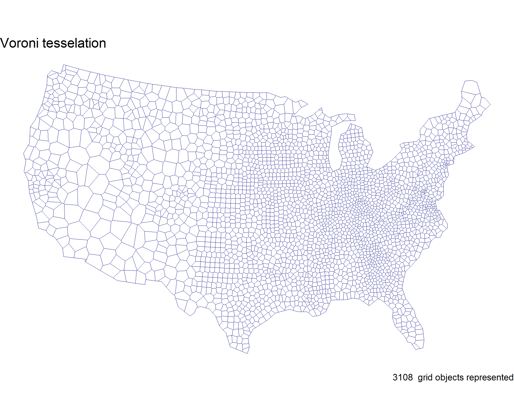
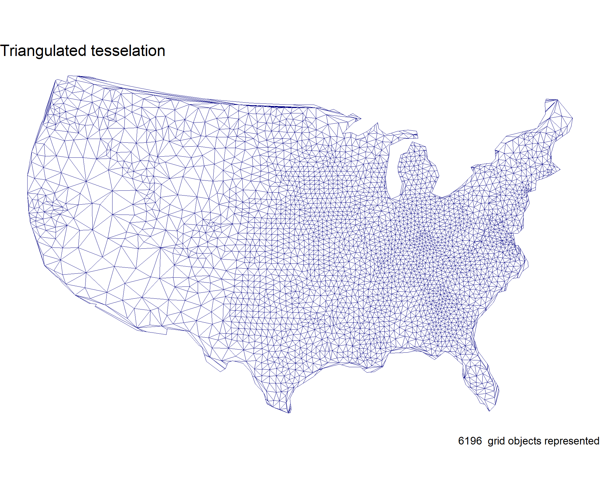
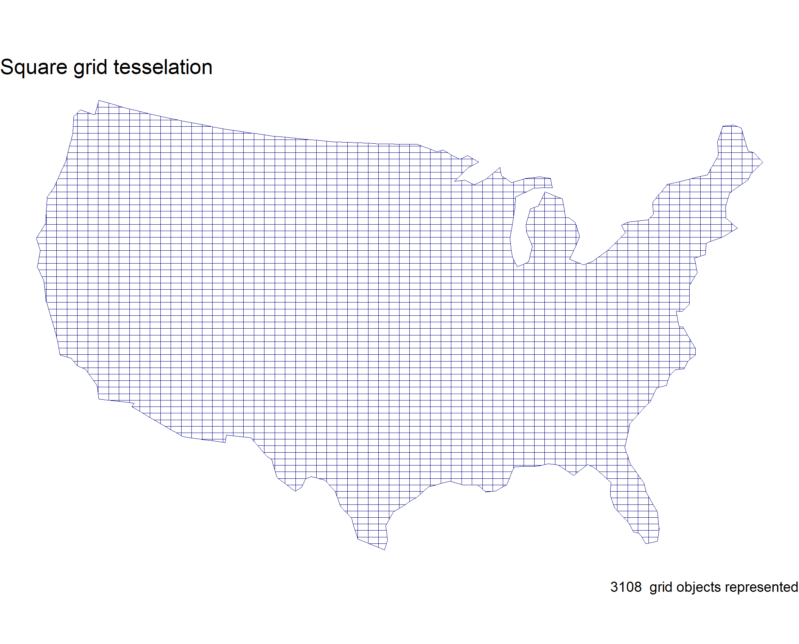
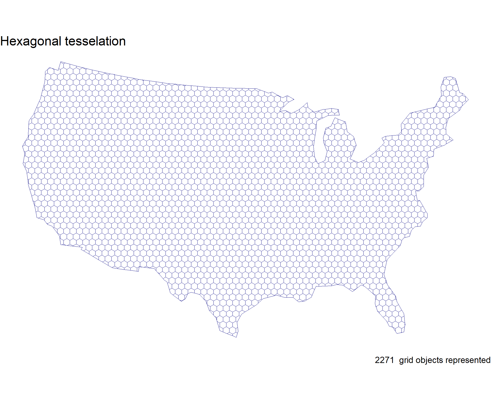
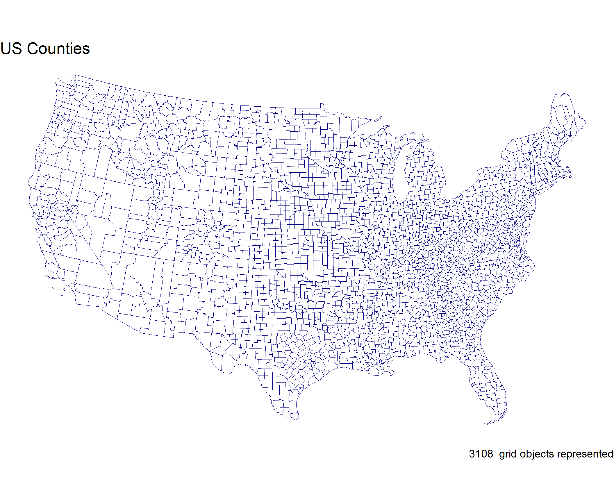
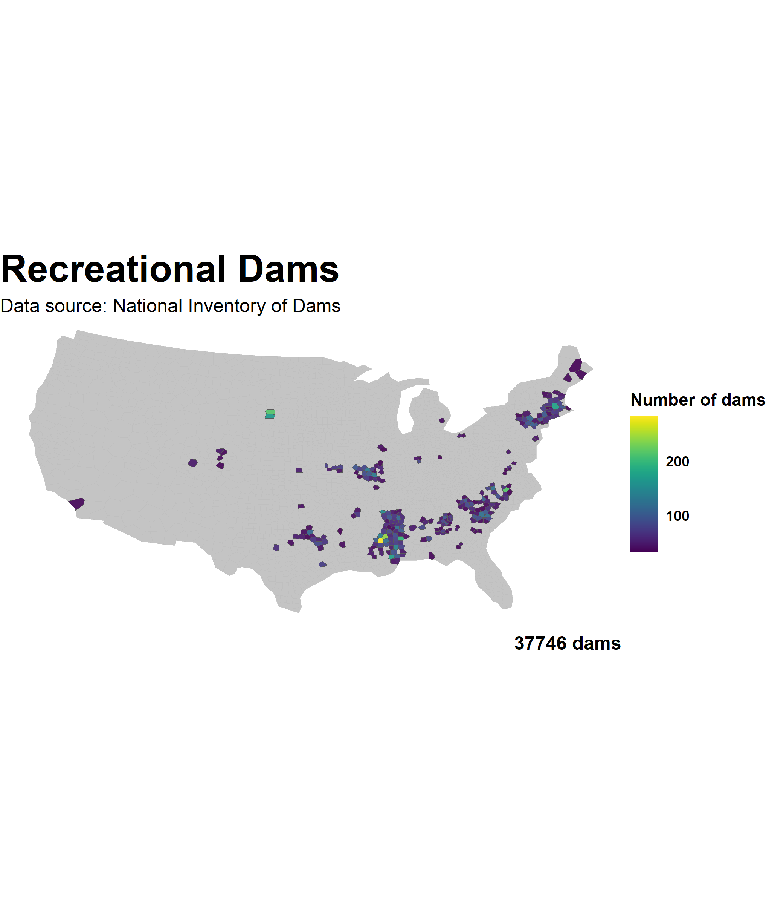
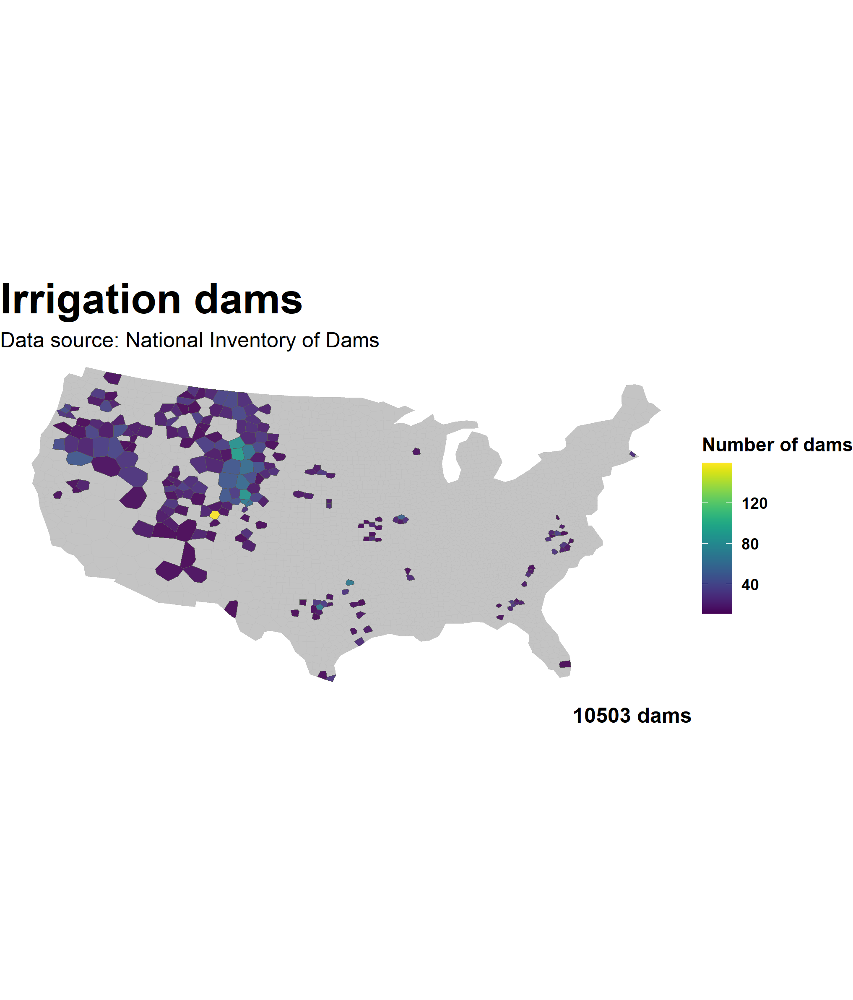
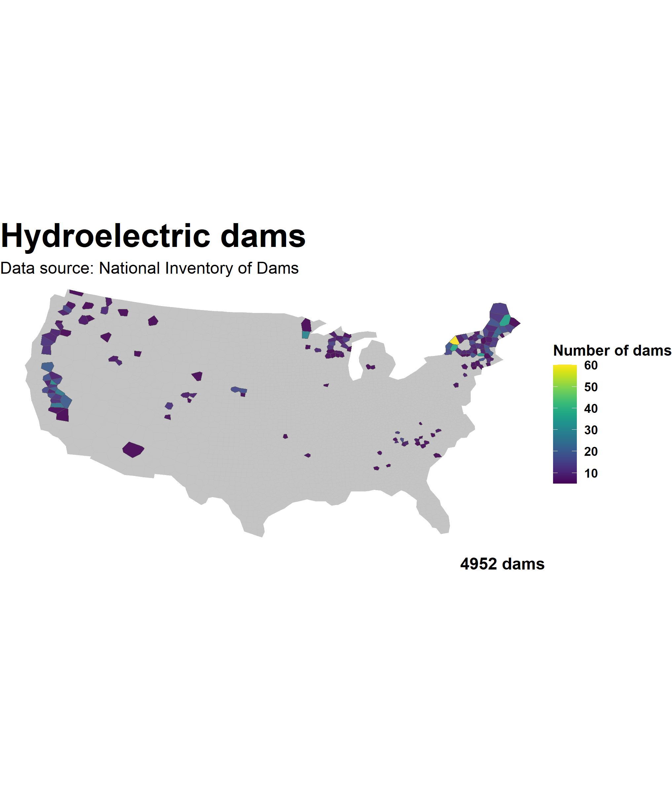
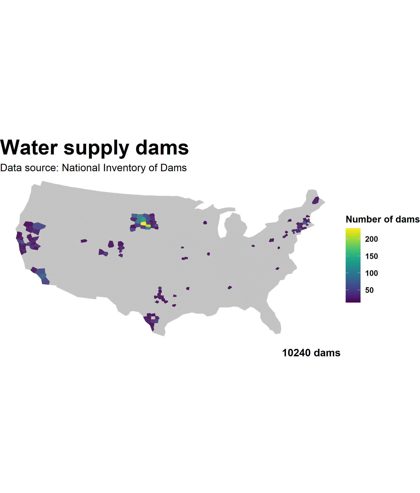

```{r, message = FALSE, warning = FALSE}
library(tidyverse)
library(readxl)
library(ggthemes)
library(sf)
library(units)
library(USAboundaries)
library(rnaturalearth)
library(gghighlight)
library(ggrepel)
library(knitr)
library(rmapshaper)
library(mapview)
library(spatstat)
```
# Question 1:


# Step 1.1
```{r, message = FALSE, warning = FALSE}
conus = us_states() %>%
  st_as_sf(coords = c('lng', 'lat'), crs = 4326) %>%
  filter(!name %in% c('Puerto Rico', 'Alaska', 'Hawaii')) %>%
  st_transform(5070)

counties = us_counties() %>%
  st_as_sf(coords = c('lng', 'lat'), crs = 4326) %>%
  st_transform(5070)


counties = counties %>%
  filter(!state_name %in% c('Puerto Rico', 'Alaska', 'Hawaii')) %>%
  mutate(id = 1:n())
```
# Step 1.2
```{r, message = FALSE, warning = FALSE}
county_centroid = counties %>%
  st_centroid() %>%
  st_combine()
```
# Step 1.3
```{r, message = FALSE, warning = FALSE}
# voroni tess
voroni_centroid = county_centroid %>%
  st_voronoi() %>%
  st_cast() %>%
  st_as_sf() %>%
  mutate(id = 1:n())

# triangulation tess
tri_centroid = county_centroid %>%
  st_triangulate %>%
  st_cast() %>%
  st_as_sf() %>%
  mutate(id = 1:n())

# square grid coverage
sq_county = st_make_grid(counties, n = 70) %>%
  st_as_sf() %>%
  mutate(id = 1:n())

# hexagonal coverage
hex_county = st_make_grid(counties, n = 70, square = FALSE) %>%
  st_as_sf() %>%
  mutate(id = 1:n())
```
# Step 1.4
```{r, message = FALSE, warning = FALSE}
counties_u = counties %>%
  st_union() %>%
  st_cast() %>%
  st_sf() %>%
  ms_simplify(keep = .05)
```
# Step 1.5
```{r, message = FALSE, warning = FALSE}
# clipped tessellations
voroni = st_intersection(counties_u, voroni_centroid)
tri = st_intersection(counties_u, tri_centroid)
sq_grid = st_intersection(counties_u, sq_county)
hex_grid = st_intersection(counties_u, hex_county)

npts(counties) 
npts(counties_u) 
```
## Consequences of simplification:
### original number of points = 51976
### simplified number of points = 161
I was able to remove 51815 points. 
Before simplifying, the computations were taking 30 - 45 seconds and also caused RStudio to crash once.
After simplifying, the computations take ~4 seconds.

# Step 1.6
```{r, message = FALSE, warning = FALSE}
tess_plots = function(sf_data, name) {
  ggplot() +
    geom_sf(data = sf_data, fill = 'white', size = 0.2, col = 'navy') +
    labs(title = name,
         caption = paste(max(sf_data$id), ' grid objects represented')) +
    theme_void()
}
```
# Step 1.7
```{r, message = FALSE, warning = FALSE}
v_plot = tess_plots(voroni, 'Voroni tesselation')
tri_plot = tess_plots(tri, 'Triangulated tesselation')
sq_plot = tess_plots(sq_grid, 'Square grid tesselation')
hex_plot = tess_plots(hex_grid, 'Hexagonal tesselation')
counties_plot = tess_plots(counties, 'US Counties')
```











# Question 2:

# Step 2.1
```{r, message = FALSE, warning = FALSE}

sf_to_df = function(sf_object, descrip) {
  area_sf = st_area(sf_object) %>%
    set_units('km^2') %>%
    drop_units()
  area_df = data.frame(tesselation = descrip, features = max(sf_object$id),
                       mean_area = mean(area_sf), std = sd(area_sf), total_area = sum(area_sf))


  return(area_df)
}
```
# Step 2.2
```{r, message = FALSE, warning = FALSE}
voroni_df = sf_to_df(voroni, 'voroni tesselation')
tri_df = sf_to_df(tri, 'triangulation tesselation')
sq_df = sf_to_df(sq_grid, 'square grid tesselation')
hex_df = sf_to_df(hex_grid, 'hexagonal tesselation')
counties_df = sf_to_df(counties, 'county grid')
```
# Step 2.3
```{r, message = FALSE, warning = FALSE}
tess_summary = bind_rows(
  sf_to_df(tri ,"triangulation"),
  sf_to_df(voroni, "voroni"),
  sf_to_df(sq_grid, 'square grid'),
  sf_to_df(hex_grid, 'hexagonal grid'),
  sf_to_df(counties, 'county'))
```
# Step 2.4
```{r, message = FALSE, warning = FALSE}
knitr::kable(tess_summary, caption = 'US county tesselations ', col.names = c('Tesselation', 'Number of features', 'Mean area', 'Standard deviation', 'Total area'))

```

# Step 2.5

## Tesselation traits:
The triangulation tesselation has the most polygon features so when a point-in-polygon analysis is done the results may be unclear as the points will be dispersed into more seperate polygons then in the other tesselations. On the other hand, the Voroni and Hexogonal tesselations have fewer polygons and thus may result in a more accurate representation of the number of points within a region of polygons. 

# Question 3:

# Step 3.1
```{r, message = FALSE, warning = FALSE}
dams = read_excel('../data/NID2019_U.xlsx')

dams_sf = dams %>%
  filter(!is.na(LONGITUDE), !is.na(LATITUDE)) %>%
  st_as_sf(coords = c('LONGITUDE', 'LATITUDE'), crs = 4326) %>%
  st_transform(5070)
```

# Step 3.2
```{r, message = FALSE, warning = FALSE}
pip_function = function(points, polygon, bar){
  st_join(polygon, points) %>%
    st_drop_geometry() %>%
    count(get(bar)) %>%
    setNames(c(bar, "n")) %>%
    left_join(polygon, by = bar) %>%
    st_as_sf()
}
```

# Step 3.3
```{r, message = FALSE, warning = FALSE}
dams_voroni = pip_function(dams_sf, voroni, 'id')
dams_tri = pip_function(dams_sf, tri, 'id')
dams_sq = pip_function(dams_sf, sq_grid, 'id')
dams_hex = pip_function(dams_sf, hex_grid, 'id')
dams_county = pip_function(dams_sf, counties, 'id')
```

# Step 3.4
```{r, message = FALSE, warning = FALSE}
plot_pip = function(data, text){
  ggplot() +
    geom_sf(data = data, aes(fill = n), alpha = .9, size = .2) +
    viridis::scale_fill_viridis() +
    theme_void() +
    theme(plot.title = element_text(face = "bold", color = "black", size = 24), plot.subtitle = element_text(size = 12),
          plot.caption = element_text(face = 'bold', size = 12), legend.title = element_text(face = 'bold'),
          legend.text = element_text(face = 'bold')) +
    labs(title = text,
         subtitle = 'Data source: National Inventory of Dams',
         fill = 'Number of dams',
         caption = paste0(sum(data$n), " dams")) +
    theme(aspect.ratio = .5)
}
```
# Step 3.5
```{r, message = FALSE, warning = FALSE}
voroni_dam_plot = plot_pip(dams_voroni, 'US dams - Voroni tessellation')

tri_dam_plot = plot_pip(dams_tri, 'US dams - Triangulation tessellation')

sq_dam_plot = plot_pip(dams_sq, 'US dams - Square grid Tessellation')

hex_dam_plot = plot_pip(dams_hex, 'US dams - Hexagonal Tessellation')

county_dam_plot = plot_pip(dams_county, 'US dams - County lines')
```

# Step 3.6

## Tesselated surfaces and point-in-polygon analysis:
I will be choosing to use the Voroni tessalation going forward as it allows you to see the regions that have the most dams most clearly. The Voroni tesselation also has the benefit of fewer point calculations than the Triangulation tesselation which requires more point calculations, thus Triangulation puts more demand on the computer and takes longer to run. In terms of MAUP, the Triangulation tesselation creates extra areas which are unneccessary and arbitray and do not add to the analysis at hand. I also like the result of the Hexogonal tesselation as it does a good job of showing the number of dams in an area, but not as clearly as the Voroni tesselation

# Question 4:

# Step 4.1
```{r, message = FALSE, warning = FALSE}
nid_classifier = data.frame(abbr = c('R', 'C', 'P', 'O', 'S', 'I', 'F', 'H', 'T', 'D', 'G', 'N'),
                            purpose = c('Recreation', 'Flood Control', 'Fire Protection', 'Other', 'Water Supply', 'Irrigation', 'Fish and Wildlife', 'Hydroelectric', 'Tailings', 'Debris Control', 'Grade Stabalization', 'Navigation'))

# create a vector of all characters in your purpose and unlist
dam_freq <- strsplit(dams$PURPOSES, split = "") %>%
  unlist() %>%
  table() %>%
  as.data.frame() %>%
  setNames(c("abbr", "count")) %>%
  left_join(nid_classifier) %>%
  mutate(lab = paste0(purpose, "\n(", abbr, ")"))

rec_dams = pip_function(dams_sf[grepl("R",  dams_sf$PURPOSES),], voroni, 'id')
flood_control_dams = pip_function(dams_sf[grepl("C",  dams_sf$PURPOSES),], voroni, 'id')
fire_dams = pip_function(dams_sf[grepl("P",  dams_sf$PURPOSES),], voroni, 'id')
water_sup_dams = pip_function(dams_sf[grepl("S",  dams_sf$PURPOSES),], voroni, 'id')
irrig_dams = pip_function(dams_sf[grepl("I",  dams_sf$PURPOSES),], voroni, 'id')
hydroelec_dams = pip_function(dams_sf[grepl("H",  dams_sf$PURPOSES),], voroni, 'id')
```

# Step 4.2
```{r, message = FALSE, warning = FALSE}
plot_pip2 = function(data, text){
  ggplot() +
    geom_sf(data = data, aes(fill = n), alpha = .9, size = .2) +
    gghighlight(n > mean(n) + sd(n)) +
    viridis::scale_fill_viridis() +
    theme_void() +
    theme(plot.title = element_text(face = "bold", color = "black", size = 24), plot.subtitle = element_text(size = 12),
          plot.caption = element_text(face = 'bold', size = 12), legend.title = element_text(face = 'bold'),
          legend.text = element_text(face = 'bold')) +
    labs(title = text,
         subtitle = 'Data source: National Inventory of Dams',
         fill = 'Number of dams',
         caption = paste0(sum(data$n), " dams")) +
    theme(aspect.ratio = .5)
}

rec_dams_plot = plot_pip2(rec_dams, 'Recreational Dams')
flood_control_dams_plot = plot_pip2(flood_control_dams, "Flood control dams")
fire_protect_dams_plot = plot_pip2(fire_dams, "Fire protection dams")
water_supply_dams_plot = plot_pip2(water_sup_dams, "Water supply dams")
```





# Step 4.3

## Analysis
Most of the water supply dams are located in dry regions of the country like Southern California, southern/central Texas, and Utah;
this makes sense as these regions experience water shortages for extended periods of time,
thus having water supplies within dams can make up for the periods of extended water shortages.

Irrigation dams are found in the southerwestern, central, and northwestern regions of the US. 
The most irrigation dams are located in the middle of the country which makes a lot of sense as large amounts of farming occurs in this region, thus the need for irrigation.

Hydroelectric dams are located in central California, the midwest Great Lakes region, and in the northeast along lake Ontario.
The presence of Hydroelectric dams in each of these regions makes sense as they are all located on river systems. In central California the hydroelectric dams are located along the Sacramento River,
in the midwest the hydroelectric dams are located on the Mississippi River, and in the northeast the dams are located along the region of Lake Ontario which flows out to the ocean.
Hydroelectric dams require moving water to operate, hence there locations along river systems.
The largest amount of hydroelectric dams are found in one county along Lake Ontario, in which ~60 hydroelectric dams are located in the area.

Most of the recreational dams are located at the end of the Mississippi river around several major metropolitan areas and population centers. It makes sense that this area has many recreational dams as the population centers will use them for recreation. 

For all of these specified dams, the Voroni tessellation allows one to see areas were dams of a specific purpose are highly concentrated. For example, in the northeast, the tile along Lake Ontario represents a location were a very high concentration of hydroelectric dams are, if it were a triangulated tessellation, the concentration within that county may be less evident as the dams are located in differing tiles.


